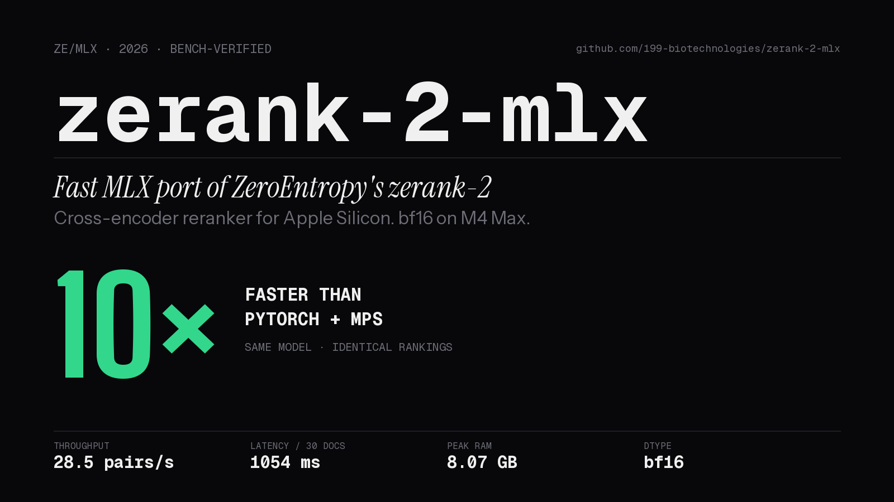
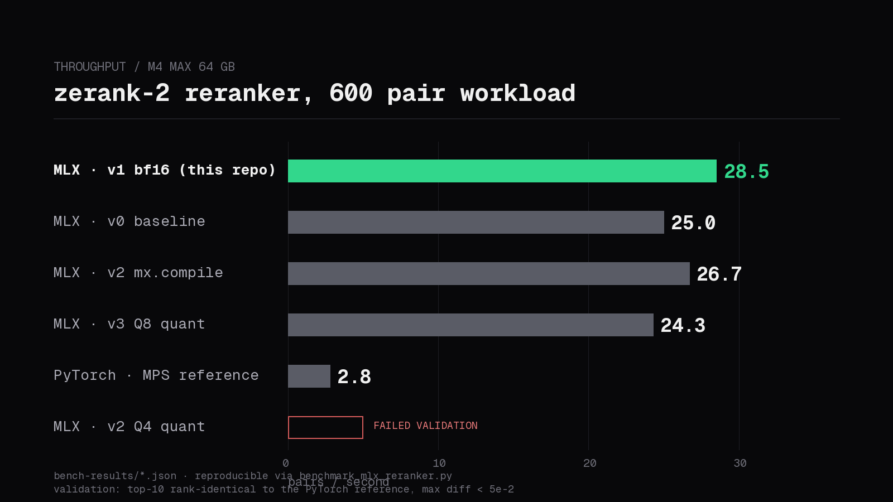

<div align="center">



# zerank-2-mlx

**The fastest way to run zerank-2, a 4B Qwen3-based cross-encoder reranker, on Apple Silicon.**

<br />

[](https://github.com/199-biotechnologies/zerank-2-mlx/stargazers)
&nbsp;&nbsp;
[](https://x.com/longevityboris)

<br />

[](LICENSE)
&nbsp;
[](https://www.python.org/downloads/)
&nbsp;
[](https://github.com/ml-explore/mlx)
&nbsp;
[](https://www.apple.com/mac/)

---

10× faster than the PyTorch + MPS reference. Same weights. Identical top-10 rankings. bf16, drop-in HTTP sidecar, 200-line Python port.

[Install](#install) · [How it works](#how-it-works) · [Benchmarks](#benchmarks) · [Roadmap](#roadmap) · [Contributing](#contributing)

</div>

---

## Why this exists

Every retrieval-augmented system needs a strong local reranker. On Apple Silicon the options are bad:

- **ZeroEntropy's upstream Python sidecar** loads `zerank-2` through `sentence-transformers` + custom `modeling_zeranker.py` and runs on PyTorch + MPS. We ran it against a 1500-question LoCoMo benchmark. It OOM'd twice, crashed on a broken-pipe loop, and lost ~100 minutes of GPU time with no partial results.
- **llama.cpp + community GGUF** has a [known bug](https://github.com/ggml-org/llama.cpp/issues/16407) that produces garbage scores (≈4e-23) for Qwen3 classifier heads. Not trustworthy.
- **Ollama MLX backend** has no `/api/rerank` endpoint ([issue #3368](https://github.com/ollama/ollama/issues/3368)), and falls back to llama.cpp on Macs below 32 GB anyway.
- **Cohere / Voyage rerank APIs** are strong but network-bound, per-token priced, and take your query data off-device.

`zerank-2-mlx` is a single purpose-built file that loads the official zerank-2 weights straight into [Apple's MLX framework](https://github.com/ml-explore/mlx), serves the exact same HTTP contract as the PyTorch sidecar, and runs in bf16 on unified memory. No custom kernels. No dependency sprawl. No model surgery. No trust-remote-code tokenizer footgun.

## Benchmarks



<div align="center">

Measured on **M4 Max, 64 GB unified memory**. Workload: 20 distinct queries × 30 candidate documents = 600 pair scores. Raw JSON in [`bench-results/`](bench-results/), reproducible with `benchmark_mlx_reranker.py`.

</div>

| Variant | pairs / sec | mean latency (30 docs) | peak RAM | status |
|---|---:|---:|---:|:---:|
| **v1 bf16 (shipped)** | **28.5** | **1054 ms** | **8.07 GB** | ✅ |
| v0 baseline (full vocab proj) | 25.0 | 1200 ms | 8.55 GB | ✅ kept |
| v2 `mx.compile` forward | 26.7 | 1123 ms | 8.00 GB | ❌ regression |
| v3 Q8 quantization | 24.3 | 1234 ms | 4.69 GB | ❌ slower + drift |
| v2 Q4 quantization | n/a | n/a | 2.26 GB | ❌ FAILED validation |
| PyTorch + MPS reference | ~2.8 | ~6300 ms | ~8.5 GB | baseline |

That's the kind of gap that turns a 3-hour LoCoMo benchmark run into an 18-minute one on the same laptop.

## What we learned (and what surprised us)

On a well-provisioned Mac, the usual "always quantize" advice is wrong. Here is what the optimisation sweep turned up.

- **Yes-token shortcut is free. (v0 → v1, +14 % throughput, −0.48 GB peak.)** `zerank-2` projects hidden states through the full `embed_tokens.as_linear` to produce a `[B, S, 151936]` logits tensor, then throws 99.999 % of it away to read the yes-token column. Running the inner `model.model(...)` to get hidden states directly, gathering at the last non-pad position per row, and projecting only that `[B, H]` slice produces identical numerics at a fraction of the work. `as_linear` handles bf16 and quantized embeddings transparently.
- **`mx.compile` regressed by 6 %.** `mlx-lm`'s Qwen3 already uses the fused primitives you want (`mx.fast.rms_norm`, `scaled_dot_product_attention`, fused SwiGLU). Wrapping the outer forward in `mx.compile(shapeless=True)` adds dispatch overhead without meaningful extra fusion. [`jundot/omlx`](https://github.com/jundot/omlx) sees the same thing for causal-LM rerankers. Kept behind `ENGRAM_ZERANK_MLX_NO_COMPILE` if you want to A/B test.
- **Q4 killed reranker quality.** Max score diff 5.47e-1, top-10 ranks flip at positions 1-2 and 4-5. Cross-encoder classifier heads are dramatically more quant-sensitive than generation — the whole score depends on a single yes-token logit (divided by 5 for calibration), so there is no averaging safety net. This matches what [`bgconley/qwen3-reranker-multi`](https://github.com/bgconley/qwen3-reranker-multi), [`jundot/omlx`](https://github.com/jundot/omlx), and the [2025 Qwen3 quantization empirical study](https://arxiv.org/html/2505.02214v1) all found independently.
- **Q8 was slower than bf16 on M4 Max.** 24.3 vs 28.5 pairs/sec. On 64 GB M4 Max with 546 GB/s unified memory bandwidth, the dequantization cost per matmul exceeds the bandwidth savings from loading fewer bytes. Q8 also showed ~3× more numerical noise than bf16 (max diff 6.25e-2), enough to flip positions 2-3 on near-tied pairs. Memory footprint halved (8.07 → 4.69 GB) but memory was never the constraint. On a 16 GB MacBook Air where bandwidth is lower, Q8 may flip this verdict — we have not measured that case.
- **The real lever is batching, not bit-width.** The query is identical across all N candidate documents in a single rerank call. A proper query-prefix KV cache would let us reuse the prefix computation and get 5-10× more throughput on `top_k ≈ 20–50`. That is the next target, tracked in the [roadmap](#roadmap) below.

## Install

You need an Apple Silicon Mac (M1 through M5) and [`uv`](https://docs.astral.sh/uv/) for dependency resolution. Everything else is transitive.

```bash
git clone https://github.com/199-biotechnologies/zerank-2-mlx.git
cd zerank-2-mlx
```

Nothing else. `uv` pulls `mlx`, `mlx-lm`, `transformers`, `safetensors`, and `huggingface_hub` the first time you invoke any of the scripts. The official [`zeroentropy/zerank-2`](https://huggingface.co/zeroentropy/zerank-2) weights download automatically from Hugging Face into your local cache on first run.

## Quick start

### HTTP server, drop-in replacement for the upstream sidecar

```bash
uv run --with mlx --with 'mlx-lm>=0.21' --with 'transformers<5.0,>=4.45' \
       --with safetensors --with huggingface_hub --with numpy \
       zerank_server_mlx.py
```

The server exposes the same contract as the ZeroEntropy reference Python sidecar at `zerank_server.py`:

```bash
# health check
curl http://127.0.0.1:8766/health
# -> {"status": "ok", "model": "zerank-2-mlx"}

# rerank
curl -X POST http://127.0.0.1:8766/rerank \
  -H 'Content-Type: application/json' \
  -d '{
    "query": "What is the capital of France?",
    "documents": [
      "Paris is the capital and most populous city of France.",
      "Berlin is the capital of Germany."
    ],
    "top_k": 2
  }'
# -> {"results": [{"index": 0, "score": 3.25}, {"index": 1, "score": -1.48}], ...}
```

Port defaults to `8766` so it does not collide with any legacy sidecar on `8765`. Override with `ENGRAM_ZERANK_MLX_PORT=9000`.

### Python API

```python
from zerank_server_mlx import load_model, score_pairs

bundle = load_model()            # downloads weights once, caches locally
scores = score_pairs(bundle, [
    ("What is the capital of France?", "Paris is the capital of France."),
    ("What is the capital of France?", "Berlin is the capital of Germany."),
])
# [3.25, -1.48]
```

Scores are the official ZeroEntropy calibration: `yes_token_logit / 5`.

### Validate against the PyTorch reference

```bash
uv run --with mlx --with 'mlx-lm>=0.21' --with 'transformers<5.0,>=4.45' \
       --with torch --with safetensors --with huggingface_hub --with numpy \
       validate_mlx_reranker.py
```

Loads both runtimes, scores 20 diverse pairs on each, asserts top-10 rankings are identical and per-pair score drift stays within bf16 cross-runtime tolerance (5e-2 absolute, ≈ 2× bf16 LSB).

### Benchmark a new variant

```bash
uv run --with mlx --with 'mlx-lm>=0.21' --with 'transformers<5.0,>=4.45' \
       --with safetensors --with huggingface_hub --with numpy \
       benchmark_mlx_reranker.py --variant my-experiment
```

Writes `bench-results/my-experiment.json` with throughput, mean and percentile latencies, peak RAM, commit SHA, and timestamp. Keep the JSONs committed so the history of what worked and what regressed lives in the repo.

## How it works

### zerank-2 is Qwen3 with a yes-token trick

ZeroEntropy's [`modeling_zeranker.py`](https://huggingface.co/zeroentropy/zerank-2/blob/main/modeling_zeranker.py) inherits from `Qwen3PreTrainedModel` and `Qwen3Model`. There is no new classifier head. `lm_head` is tied to `embed_tokens` (standard Qwen3), the model runs a full forward pass, and scoring is three lines:

```python
last_pos = attention_mask.sum(dim=1) - 1
yes_logits = logits[batch_idx, last_pos, yes_token_id]
score = yes_logits / 5.0
```

`yes_token_id = 9454`. The `/ 5` divisor is the calibration constant ZeroEntropy chose so scores live in a readable range.

### The port in one paragraph

We symlink the Hugging Face snapshot into a tempdir, rewrite `config.json`'s `model_type` from `zeroentropy` to `qwen3` so `mlx-lm` takes the Qwen3 code path, swap `tokenizer_config.json` from the custom `ZeroEntropyTokenizer` to the stock `Qwen2TokenizerFast` (we inline the chat template ourselves so trust-remote-code is not needed), and call `mlx_lm.load()`. The resulting MLX `Model` already handles `tie_word_embeddings=True` via `embed_tokens.as_linear(hidden_state)`. We then gather the hidden state at each row's last non-pad position, project only that `[B, H]` slice, select the yes-token column, and divide by 5. That is the entire port.

### Why no explicit padding mask

Qwen3 is decoder-only with causal attention. With right padding (`padding_side="right"`), the hidden state at `last_non_pad_position` only attends to real tokens — the causal mask enforces it. So we can batch variable-length `(query, doc)` pairs, right-pad them, and extract per-row logits without ever needing a padding mask. Verified against `mlx_lm/models/qwen3.py` and the reference PyTorch output.

### The chat template, inlined

```
<|im_start|>system
{query}
<|im_end|>
<|im_start|>user
{document}
<|im_end|>
<|im_start|>assistant
```

Matches exactly what `PreTrainedTokenizerFast.apply_chat_template(..., add_generation_prompt=True)` produces from zerank-2's `chat_template.jinja` in the no-tools case.

## Roadmap

Every variant is gated by the validation harness. Anything that breaks top-10 ranking gets reverted. Anything that regresses throughput gets documented as a negative result and reverted.

- [x] **v0** — `mlx-lm` Qwen3 forward + full vocab projection + yes-token extraction. 25.0 pairs/sec. Top-10 rank-identical to PyTorch reference.
- [x] **v1** — yes-token shortcut (bf16, SHIPPED). **28.5 pairs/sec**, top-10 rank-identical, max diff 3.12e-2.
- [x] **v2** — `mx.compile(shapeless=True)` on the outer forward. REGRESSED. Behind `ENGRAM_ZERANK_MLX_NO_COMPILE=1`.
- [x] **v2** — Q4 quantization. FAILED validation (max diff 5.47e-1).
- [x] **v3** — Q8 quantization. REGRESSED on M4 Max (24.3 pairs/sec) plus measurable quality drift.
- [ ] **v4** — query prefix KV cache reuse. Compute the query prefix KV once per rerank call, reuse across all N document continuations. Potentially 5-10× on `top_k ≈ 20–50`.
- [ ] **v5** — larger batches. M4 Max 64 GB can comfortably batch 60-240 pairs per forward pass; measure and pick the sweet spot.
- [ ] **v6** — `mx.async_eval` pipelining to overlap prefill and extract across inbound HTTP requests.
- [ ] **v7** — mixed-precision quantization via `mlx_lm.convert --quant-predicate`: keep `embed_tokens`, `lm_head`, and layer norms at bf16 while quantizing the transformer body. Only worth exploring if we need the memory for 8B+ variants later.

## Repository layout

```
zerank-2-mlx/
├── zerank_server_mlx.py          # MLX HTTP sidecar, drop-in for the PyTorch reference
├── validate_mlx_reranker.py      # Correctness gate vs the PyTorch reference
├── benchmark_mlx_reranker.py     # Throughput / latency / peak-RAM harness
├── bench-results/                # Committed benchmark JSON per variant
├── assets/                       # Hero + benchmark images used in this README
├── README.md
└── LICENSE                       # MIT (code). Weights remain CC-BY-NC 4.0.
```

## Model licence

[ZeroEntropy's zerank-2 weights](https://huggingface.co/zeroentropy/zerank-2) are licensed under **CC-BY-NC 4.0** (non-commercial). This repository is MIT-licensed, but the model weights it loads are not, so check ZeroEntropy's terms before using this in a commercial product. For commercial use, talk to ZeroEntropy directly or use their hosted API.

The code in this repository (the MLX port, the validator, the benchmark harness, the image generators) is MIT-licensed and can be adapted to other models — Qwen3-Reranker, Jina Reranker v3, mxbai-rerank — without restriction.

## Contributing

Optimization ideas, bug reports, and weird edge cases welcome. Before sending a PR:

1. Run `validate_mlx_reranker.py`. It must pass (top-10 rank-identical to the PyTorch reference on the 20 test pairs).
2. Run `benchmark_mlx_reranker.py --variant <your-change-name>` and commit the resulting JSON under `bench-results/` alongside the code.
3. Explain the change in the commit message: what it does, why, expected speedup, any risk. Negative results are welcome — they prevent the next person from repeating the experiment.

If you add a new optimization variant, keep the baseline path reproducible so we can always revert.

## Related projects

- [zeroentropy/zerank-2](https://huggingface.co/zeroentropy/zerank-2) — the model card
- [ml-explore/mlx](https://github.com/ml-explore/mlx) and [ml-explore/mlx-lm](https://github.com/ml-explore/mlx-lm)
- [jina-ai/mlx-retrieval](https://github.com/jina-ai/mlx-retrieval) — reference Qwen2 cross-encoder implementation on MLX
- [willccbb/mlx_parallm](https://github.com/willccbb/mlx_parallm) — `BatchedKVCache` pattern we plan to borrow for v5
- [bgconley/qwen3-reranker-multi](https://github.com/bgconley/qwen3-reranker-multi) — independent Qwen3-Reranker MLX service with the same compile-and-fall-back pattern
- [jundot/omlx](https://github.com/jundot/omlx) — full MLX inference engine with reranker support
- [engram](https://github.com/199-biotechnologies/engram) — the 199 Biotechnologies memory engine this sidecar was built for (coming soon)

---

<div align="center">

Built by [Boris Djordjevic](https://github.com/longevityboris) at [199 Biotechnologies](https://github.com/199-biotechnologies)

<br />

**If this saved you from writing your own PyTorch → MLX port:**

[](https://github.com/199-biotechnologies/zerank-2-mlx/stargazers)
&nbsp;&nbsp;
[](https://x.com/longevityboris)

</div>
